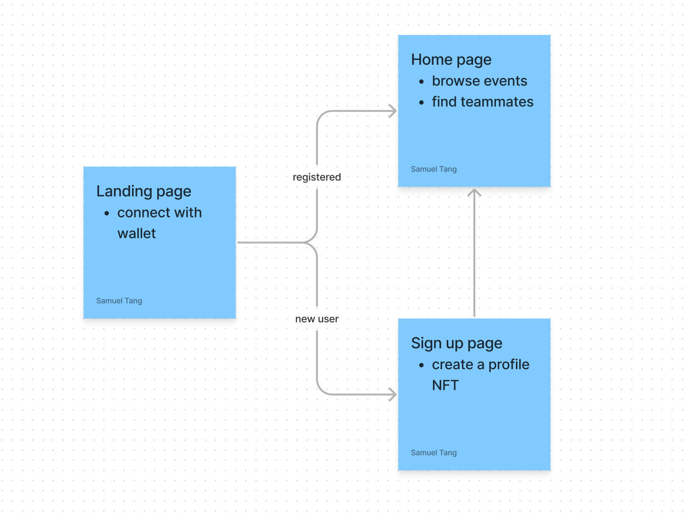

## Ordinary - Let's build better teams!
  

## User Story
  

## Smart Contracts
* ProfileNFT.sol - user profile NFT  
* Event.sol - specific event  
* EventFactory.sol - event factory

  

## Technologies
* React - frontend library
* NFT.Storage - IPFS & Filecoin for NFT storage
* Ethereum - smart contracts on blockchain 

  

## Run the project locally
* frontend 
    * `json-server --watch db.json`
    * `npm install` and `npm start`
* contracts
    * [deploy](https://hardhat.org/hardhat-runner/docs/guides/deploying) if needed

## Dependencies
* JSON Server: https://github.com/typicode/json-server
* Ant Design: https://ant.design/components/overview
* Hardhat: https://hardhat.org/docs
* Font: [Josefin Sans](https://fonts.google.com/specimen/Josefin+Sans)

## Resources & Inspirations
* [Defining the web3 stack](https://edgeandnode.com/blog/defining-the-web3-stack/)  
* [Interacting With Smart Contracts Using Web3](https://blog.openreplay.com/interacting-with-smart-contracts-using-web3/)
* [The Future Will Be Shaped by Optimists by Kevin Kelly | TED](https://youtu.be/FrqBWQ-mVEc)